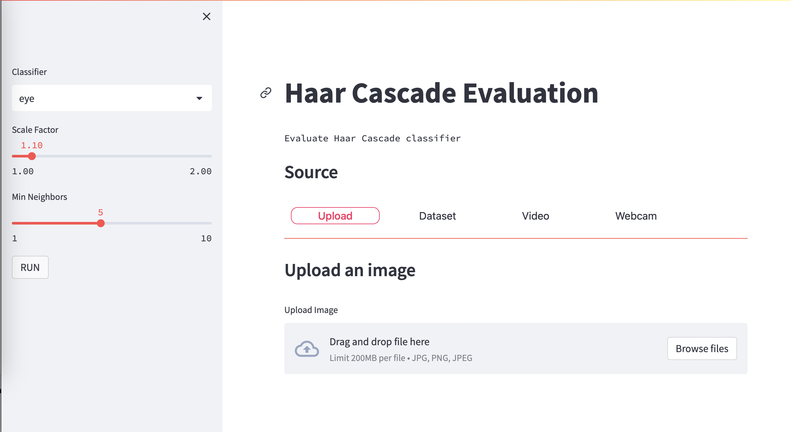

# Classifier-App using Haar Cascades

Python app using OpenCV and Haar Cascades test

Test
Test2

## Update requirements file
poetry export -f requirements.txt --output requirements.txt

## Implementation with Streamlit

## Live Demo

The project is deployed on the Streamlit cloud:

https://jk-fhswf-pki-a22-app-app-codcuk.streamlit.app/
