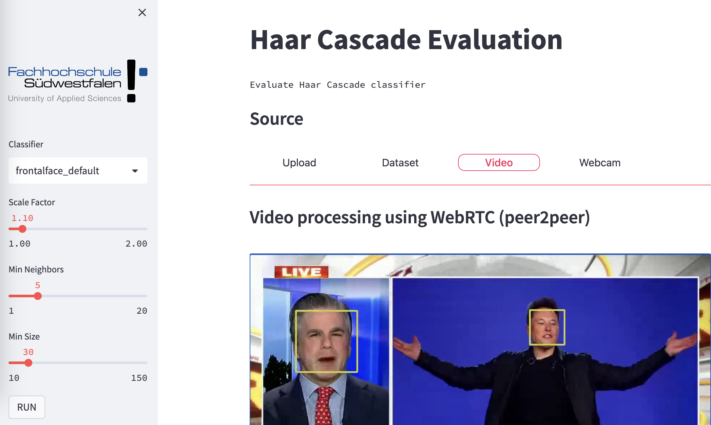
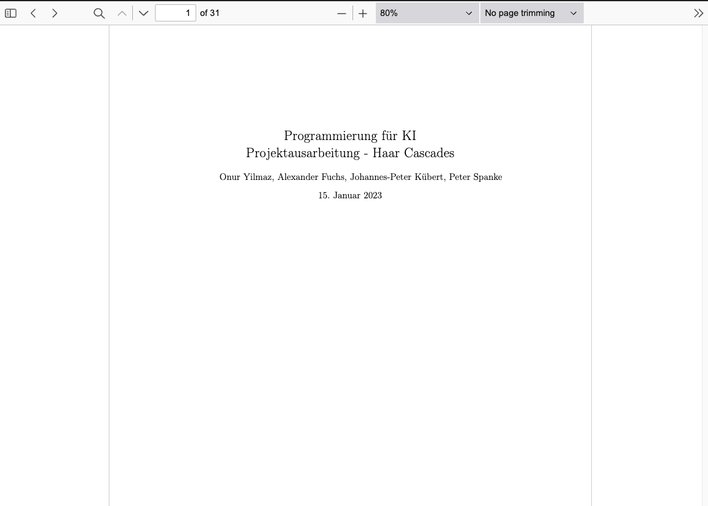

# Haar Cascade Evaluation Apps with Streamlit and Tkinter

In this project we developed an object detection App using Haar Cascade classifier in two different ways: one as web dashboard with [Streamlit](https://streamlit.io/) and one as desktop app using [Tkinter](https://docs.python.org/3/library/tkinter.html). 

You can find a [demo](https://jk-fhswf-pki-a22-app-app-codcuk.streamlit.app/) of the Streamlit app deployed on the [Streamlit cloud platform](https://streamlit.io/cloud).

&nbsp;
<div align="center">

**Streamlit Application:**



</br>
</br>

**Tkinter Application:**


</div>


## Documentation

The  paper to this project is available as [PDF-file](doc/tex/main.pdf) under "doc/tex/main.pdf".
<div align="center">
    
</div>

## Installation

We generally recommend installing the library inside a virtual environment. In your virtual environment install
the required dependencies:

```
pip install -r pip_packages.txt
```

Or if you already have the package manager [poetry](https://python-poetry.org/) simply run
```
poetry install
```

This will create a virtual environment in the folder **.venv** for you.

## Run

The Streamlit app can be executed using the streamlit module: 
```
stremlit run app.py
```
This will start a local webserver and serve the dashboard under [http://localhost:8501](http://localhost:8501)

For starting the Tkinter app use:

```
python app_tkinter.py
```

## Development

### Prerequisites

We use [poetry](https://python-poetry.org/) as package manager. Please make sure to have poetry installed before.


### Dependencies

To setup a virtual environment with all necessary dependencies use the poetry package manager:

```
poetry install
```

This will create a virtual environment inside the folder ".venv". 


### Development Environment

All common development environments for python support the poetry package manager by default. We used Pycharm and VSCode.


### Export requirements file

If you want to use a different virtual environment you can export the dependencies using:
```
poetry export -f requirements.txt --output pip_packages.txt
```
Note: we do not use the default name "requirements.txt" since this will interfere with the requirements defined in poetry.lock when deploying to the streamlit cloud platform.


## Authors

The project was developed by the following persons:


* Alexander Fuchs
* Onur Yilmaz
* Peter Spanke
* Johannes-Peter Kübert


### License

This project is licensed under the [MIT License](https://opensource.org/licenses/MIT)


### References


* [streamlit](https://streamlit.io/)
* [sreamlit-webrtc](https://github.com/whitphx/streamlit-webrtc)
* [hackaday face detection](https://hackaday.io/project/12384-autofan-automated-control-of-air-flow/log/41956-face-detection-using-a-haar-cascade-classifier)
* [GitHub Action Poetry](https://jacobian.org/til/github-actions-poetry/)